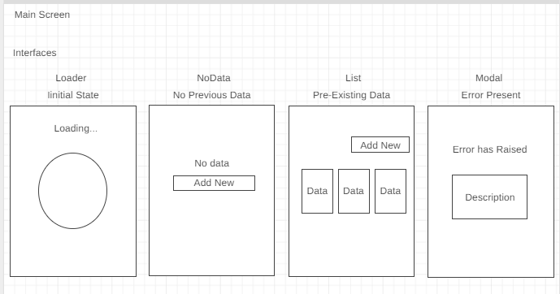
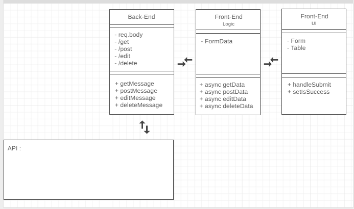

# MERN Kata
This kata has two parts: back-end & front-end.

## Back-End kata
It consists of an Express server with http verbs endpoints to perform crud operations over mongodb and needed surroundings to work.
It consists in two parts:
* Express server with http verbs endpoints to perform crud operations over mongodb and needed surroundings to work.
* A business logic that relate incoming requests with service providers to give a response back.

## Front-End kata
This kata its break into two parts:
* UI (user interface & interactions) that is html plus differents kinds of data like images or text.
* A business logic that relate the user requests with the application programming interface to obtain a response.

#### UI Wireframe
Orientative UI wireframe

#### UML schema
Orientative UML schema

## Busines logic
Front-End products has distant intrinsic areas of work that differentiate each other by the code it provide.

The user needs are visual and material, they looking for data representation.

The logic involves standards of data and requests to obtain a response. Solutions are configured like functionality structure to be called to get the data that users need to be represented.

# Sandbox Branch
This branch will integrate development path step by step.

#### Development Path
Development will follow design patterns.

###### Design Patterns
1. single purpose : logic structures shall not perform more than one functionality.
2. isolation : identify parts from the whole and get them separate to avoid monolith applications.

###### Development Steps Path
1. [x] Setup Express Server
2. [x] Setup Routes Endpoints (Front-End targets)
3. [x] Setup Endpoints Requests Handlers (Front-End data extraction)
4. [ ] Configuring External Data Services (keys, data entry points)
5. [ ] Relate Endpoints Handlers with External Data Services
6. [ ] Configure Response Handlers

# FrontEnd Branch
This branch will integrate development path step by step.

#### Development Path
Development will follow design patterns.

###### Design Patterns
1. Feature folder structure : files & folders linked by the feature they contribute to render
2. Separation from | Logic | User Interface | User Interactions |
2. single purpose
3. isolation

###### Development Steps Path
* UI
  1. [ ] Basic Screens
  2. [ ] Representation Components
  3. [ ] Interactive Components
  4. [ ] State Components

* Logic
  1. [ ] Local Methods to Service calls
  2. [ ] Data extraction from UI
  3. [ ] Entrypoints Query Setup
  4. [ ] Requests handlers
  5. [ ] Response handlers
