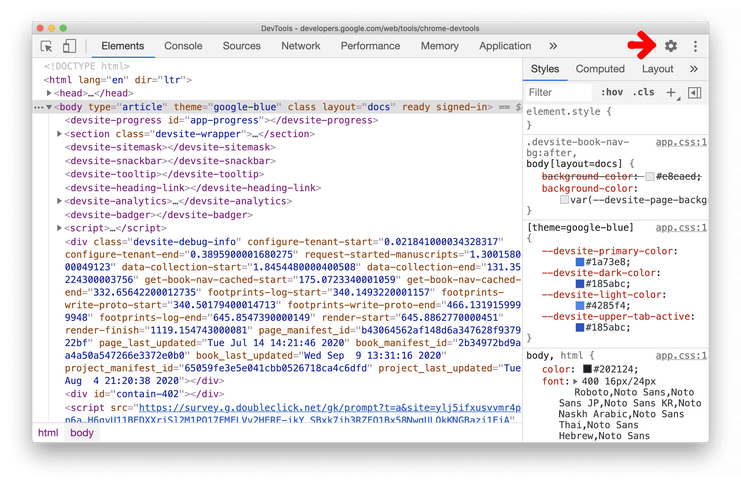
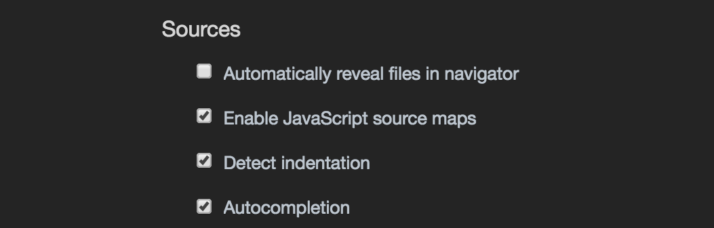

# React Kata
This kata set a basic React skeleton and React Routes (with nested routes included) capable to display images and load asset resources.

Is based in three stacks that are Webpack, Babel & React itself.

## Webpack
Webpack has in charge to coordinate & recognize all the different flavors around a React Web App like js, jsx, css, images, and to bundle all this into a single files to be rendered by the browser guided by its own configuration file `webpack.config.js`

#### Webpack Packages (7)
* webpack
* webpack-cli
* webpack-dev-server
* html-webpack-plugin
* style-loader
* css-loader
* babel-loader

~~~
npm i webpack webpack-cli webpack-dev-server html-webpack-plugin style-loader css-loader babel-loader
~~~

#### `webpack.config.js`
It's important to have 'index.js' into `./src` and a `index.html` into the configured folder mentioned in `template` when this configuration is loaded. If this files are not into their correct place at runtime It will crash by thrown a fatal error.
~~~
const HtmlWebpackPlugin = require('html-webpack-plugin');
const htmlPlugin = new HtmlWebpackPlugin({
  'template': './src/views/index.html',
  'filename': 'index.html'
})

module.exports = {
  module: {
    rules:[
      {
        test:/\.js$/,
        exclude:/node_modules/,
        use:['babel-loader']
      },
      {
        test:/\.css$/,
        use:['style-loade','css-loader']
      },
      {
        test:/\.(png|jpe?g|gif|svg)$/i,
        type: 'asset/resource'
      }
    ]
  }
  plugins: [htmlPlugin]
}
~~~

## Babel
Babel process jsx, jsE6 & node js. It require a configuration `.babelrc` file.

#### Packages
* @babel/core
* @babel/preset-env
* @babel/preset-react

~~~
npm i @babel/core @babel/preset-env @babel/preset-react
~~~

#### `.babelrc`
This file is wrote in json. Activate react lecture and Node javascript.
~~~
{
  "presets":[
    [
      "@babel/preset-env",
      "targets":{
        "node":"current"
      }

    ]
    "@babel/preset-react"
  ]
}
~~~

# React, React DOM & React Router Dom
React is the core of this kata, react package enable its core and react-dom concede to DOM access in a handy way. React Router Dom will provide URL based navigation and nested routes.

#### Packages
* react
* react-dom
* react-router-dom

~~~
npm i react react-dom react-router-dom
~~~

#### Special Config to Handle Routes
Nested routes require a special configuration into `webpack.config.js` file to be accessible.

* `entry` object explicits `index.js` location.
* `output` object
  - `path` set the output folder path with `path.resolve` in `dist`
  - `filename` define the name of the bundle file
  - `publicPath` explicts the root
* `devServer` object
  - `historyApiFallback` set to true history navigation

~~~

module.exports ={
  entry:'./src/index.js',
  output:{
    path:path.resolve(__dirname,'dist'),
    filename:'index_bundle.js',
    publicPath:'/'
  }
  module:{...},
  devServer:{
    historyApiFallback:true
  }
  plugins:[...]
}

~~~

# Notes

## Disable Yellow Warnings from Chrome Console
How to hide the yellow warning from missing .map files?

This warnings are not from Webpack or NodeJs or packages but from Chrome Console. So, its matter of configuration Chrome Console DevTools.

1. Select Source panel

2. Settings > Preferences contains many options for customizing DevTools.

3. Source > Turn off "Enable JavaScript source maps"

## Form Elements
There are a couple of form elements that It could be handle in the same way. Those are input.text, input.checbox & select.

the input.checkbox and input.radios could be used like "display-by-state" buttons to show or to be hidden other elements

//
